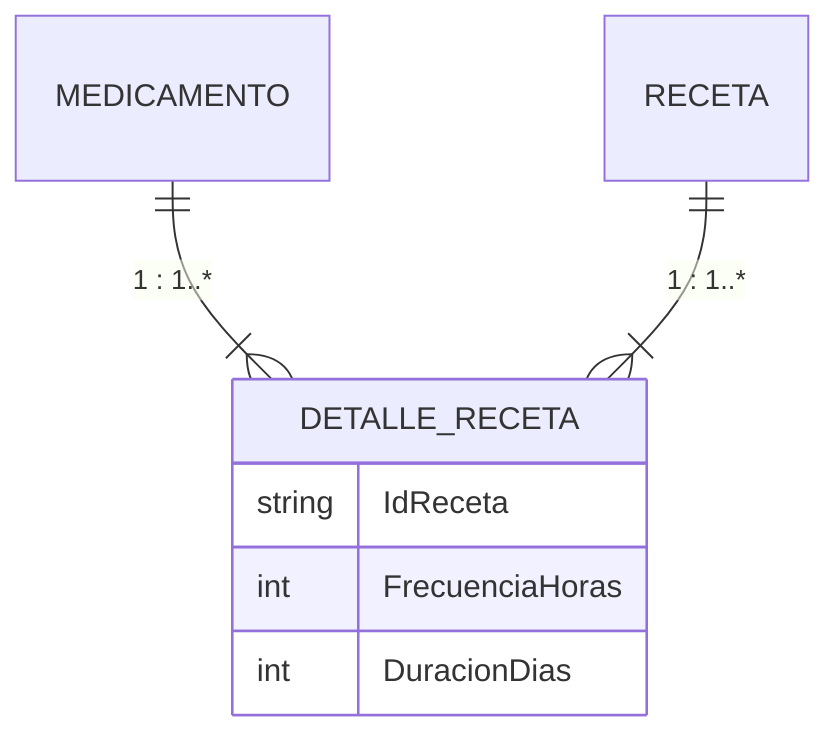
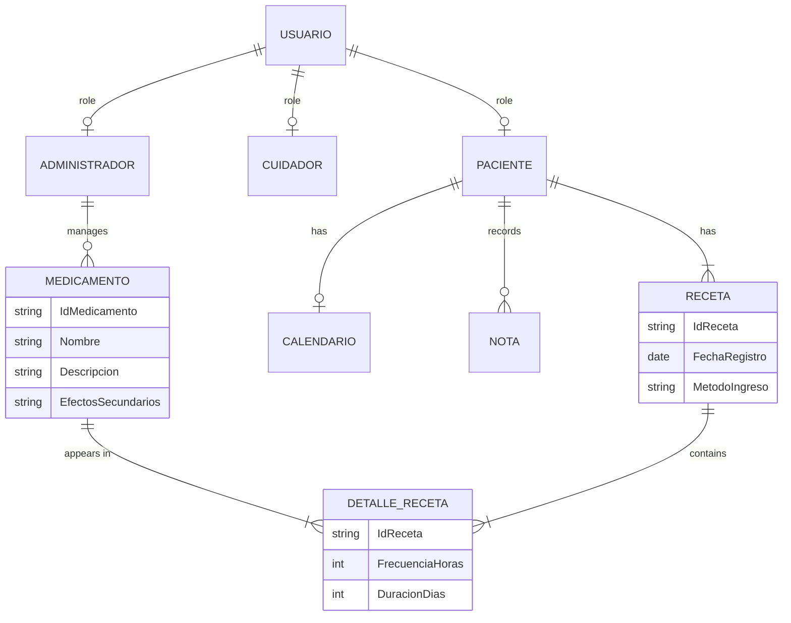

# MiDosis — Implementation Foundation

## 1. Purpose and source-of-truth rules

This document is the implementation foundation for **MiDosis**. It consolidates the project requirements, actors, domain model, interface components, OMT++ design, MVC structure, event traces, technology decisions, persistence requirements, and implementation constraints established in the project documentation and the current implementation decisions.

This document is intended to be usable as a source of truth by an AI coding agent or developer implementing the system.

**Do not introduce product features, actors, business rules, workflows, or technologies that are not specified here.** If an implementation detail is not defined, preserve the existing model and ask for clarification rather than inventing a new feature.

The project documentation describes MiDosis primarily as a mobile application with cloud processing, while the current implementation target also includes a web client. The current target is therefore a shared Flask backend consumed by Flutter clients for mobile and web. This does not add a new business capability; it only reflects the current client target.

---

# 2. Project identity

**Project:** MiDosis

**Institution:** Universidad de Santiago de Chile

**Course:** Ingeniería de Software II

**Purpose:** A medication and prescription-management application intended to help patients, especially older adults, organize medical prescriptions digitally, understand their medications, manage medication schedules, receive reminders, record adverse effects/symptoms, and share a medication calendar with a caregiver.

**Development methodology:**

- SCRUM
- OMT++

**Object-oriented architecture/design:**

- Model–View–Controller (MVC)

**General architecture:** client/server.


> **IMPORTANT MODEL REVISION — DetalleReceta**
>
> The prescription data model has been redesigned. `FrecuenciaHoras` and `DuracionDias` are **prescription-specific dosage/treatment attributes**, not attributes of `Medicamento`. A new entity/table named `DetalleReceta` has been introduced to represent the medication-specific details inside a prescription.
>
> `DetalleReceta` contains the following explicitly defined attributes:
>
> ```text
> IdReceta
> FrecuenciaHoras
> DuracionDias
> ```
>
> The relationships are:
>
> - `Medicamento` **1 → 1..*** `DetalleReceta`: each `Medicamento` is associated with one or more `DetalleReceta` records; each `DetalleReceta` is associated with exactly one `Medicamento`.
> - `DetalleReceta` **1..* → 1** `Receta`: each `Receta` contains one or more `DetalleReceta` records; each `DetalleReceta` belongs to exactly one `Receta`.
>
> This relationship allows the same medication to participate in different prescriptions with different `FrecuenciaHoras` and `DuracionDias` values. These values therefore must never be stored as global properties of `Medicamento`.
>
> All implementation decisions in this document must follow this revised model.

---

# 3. Problem being solved

The central problem is the lack of information and accompaniment patients experience when beginning a treatment.

Medical instructions are commonly delivered as paper prescriptions. These are static, easy to lose or damage, and contain limited information. They generally provide only basic information such as medication name, dosage, and schedule, while the patient may lack context such as the reason for the prescription, precautions, and possible side effects.

MiDosis addresses this by digitizing prescription information and organizing the resulting treatment information in a form that can be consulted and managed by the patient.

The system supports:

- organization of prescriptions;
- medication schedule management;
- medication reminders;
- medication information;
- recording symptoms/adverse effects;
- sharing the medication calendar with a caregiver.

MiDosis is a support and control tool. It must not be used for self-medication or for altering doses without professional supervision.

---

# 4. Scope

## 4.1 Included

The system includes:

- prescription registration by camera/photo scanning;
- prescription registration by PDF document;
- manual prescription registration;
- review/correction/confirmation of prescription information;
- automatic medication-calendar generation;
- medication schedule management;
- medication frequency management;
- medication-duration management;
- medication deletion;
- medication reminders;
- medication information consultation;
- patient adverse-effect/symptom notes;
- medication-calendar sharing through a synchronization code;
- caregiver calendar synchronization;
- Google authentication for the protected workflows defined by the requirements;
- administrator medication-information management;
- medication identification against CENABAST data;
- partial offline operation for local calendars and notifications;
- server-side prescription processing using EasyOCR and medSpaCy.

## 4.2 Explicit limitations

The system does not:

- guarantee OCR accuracy for irregular handwriting;
- allow medication-dose alteration as a medical decision;
- replace professional medical supervision;
- perform medical diagnosis;
- treat OCR output as authoritative without user validation;
- perform advanced server-side prescription processing without internet connectivity.

---

# 5. Actors

## 5.1 Paciente

The person who receives the medical prescription.

The patient can:

- register a prescription;
- scan a prescription using the camera;
- upload a prescription PDF;
- enter prescription information manually;
- review and correct prescription information;
- generate a medication calendar;
- manage the medication calendar;
- remove medications;
- modify schedules;
- modify frequency;
- modify duration;
- receive medication reminders;
- consult medication information;
- record adverse-effect/symptom notes;
- generate a synchronization code;
- share the medication calendar with a caregiver;
- authenticate with Google when required for synchronization.

## 5.2 Cuidador

The person responsible for supervising the patient.

The caregiver can:

- authenticate with Google when required;
- enter a synchronization code;
- link to a patient's shared medication calendar;
- view the shared medication calendar;
- consult medication information available through the shared calendar;
- receive updated calendar information when the patient modifies the calendar.

The specified caregiver use cases do not give the caregiver permission to modify the patient's prescription/calendar.

## 5.3 Administrador

The actor responsible for managing medication information.

The administrator can:

- authenticate with Google;
- view the medication list available to the system;
- search medications;
- modify medication information;
- manage side-effect information;
- manage medication descriptions/recommendations;
- save medication-information changes.

Administrator medication management requires login.

---

# 6. Functional requirements

## 6.1 Patient

### FR-P01 — Register prescription by scan

The system must allow the patient to scan a medical prescription using the mobile device camera and extract medication information.

### FR-P02 — Register prescription by PDF

The system must allow the patient to upload a prescription in PDF format and process its medication information.

### FR-P03 — Register prescription manually

The system must allow the patient to enter prescription information manually.

### FR-P04 — Validate prescription information

The patient must be able to review, modify, and confirm information obtained from a scanned prescription, uploaded PDF, or manual entry before the prescription is registered.

### FR-P05 — Generate medication calendar

The system must automatically generate an interactive medication calendar using registered prescription information.

### FR-P06 — Configure medication schedules

The patient must be able to configure medication consumption times and cycles for each registered medication.

### FR-P07 — Send reminders

The system must send notifications to the patient according to the schedules configured in the medication calendar.

### FR-P08 — Register adverse-effect notes

The system must allow the patient to register observations related to adverse effects or symptoms associated with treatment.

### FR-P09 — Consult medication information

The system must allow the patient to view medication information, including recommendations and possible side effects.

### FR-P10 — Generate synchronization code

The system must allow the patient to generate a unique code for sharing the medication calendar.

### FR-P11 — Share calendar

The system must allow the patient to share the medication calendar with a caregiver using a synchronization code.

## 6.2 Caregiver

### FR-C01 — Link shared calendar

The caregiver must be able to enter a synchronization code to link to a registered patient's medication calendar.

### FR-C02 — View shared calendar

The caregiver must be able to view the medication calendar shared by the patient.

### FR-C03 — Update synchronized calendar

The system must update the shared calendar when the patient modifies the calendar.

## 6.3 Administrator

### FR-A01 — View medication list

The administrator must be able to view the complete medication list available from the CENABAST data used by the system.

### FR-A02 — Manage side effects

The administrator must be able to add, edit, and remove medication side-effect information.

### FR-A03 — Manage recommendations

The administrator must be able to add, edit, and remove medication recommendations/description information.

### FR-A04 — Search medications

The administrator must be able to search registered medications.

---

# 7. Non-functional requirements

## 7.1 Compatibility

The application must operate on Android and iOS. The current project target also includes a Flutter web client using the same backend.

## 7.2 Usability and accessibility

The interface must be:

- simple;
- clear;
- legible;
- appropriate for older adults.

## 7.3 Availability and connectivity

The system must function partially without internet access.

Medication calendars and notifications must be stored locally.

Advanced prescription reading requires internet access to communicate with the server.

External services are expected to be available continuously except during maintenance.

## 7.4 Security and privacy

Basic access does not require authentication.

Cloud synchronization for shared calendars requires Google authentication.

Medical data must be stored with local privacy.

The specified implementation technology for user control/authentication is Google Cloud Console.

## 7.5 Concurrent processing

The server requires base processing capacity to handle requests from multiple users simultaneously.

## 7.6 OCR limitation

Irregular handwritten prescriptions can reduce scan accuracy. The patient must always validate the extracted information.

## 7.7 Medical-safety limitation

The application is a support/control tool and must not be used for self-medication or to alter doses without professional supervision.

---

# 8. Technology stack

| Technology | Version | Project use |
|---|---:|---|
| Python | 3.14.1 | Backend runtime |
| Flask | 3.1.2 | Backend/routing framework |
| EasyOCR | 1.8.1 | Prescription scanning/text extraction |
| medSpaCy | 1.2.1 | Prescription data detection/processing |
| Flutter | 3.30.5 | Client interface |
| MySQL | 9.1.0 | Server-side application database |
| CENABAST | — | Medication source data |
| Google Cloud Console | — | Google authentication |
| Docker | — | Reproducible backend/database development environment |
| Docker Compose | — | Development orchestration |
| SQLAlchemy | — | Database access layer for Flask |

VS Code, Git/GitHub, and Prism are development/documentation tools and are not part of the application architecture.

## 8.1 Database decision

The current implementation uses **MySQL as the single application database**.

Do not create a second application database or a SQLite database service.

The requirement that calendars and notifications be stored locally refers to client-local application data; it does not require a second server database.

---

# 9. CENABAST data

CENABAST is represented in the current implementation by an **XLSX file** containing medication information.

It is not a live REST API and must not be implemented as one.

The backend/server uses the XLSX data as medication source data.

The system must be able to identify medications present in the CENABAST list.

Medication information represented by the project includes the medication attributes already defined by the model, including:

- `IdMedicamento`;
- `Nombre`;
- `Descripción`;
- `EfectosSecundarios`.

`FrecuenciaHoras` and `DuracionDias` are **not global medication attributes**. They belong to `DetalleReceta` because they describe how a specific medication is used within a specific prescription. The CENABAST XLSX must therefore not be treated as the source of a medication's patient-specific prescription frequency or duration unless the source data explicitly provides such information.

The actual XLSX columns must be respected when the real source file is provided. Do not invent additional CENABAST fields.

The administrator manages medication information exposed by the system, including side effects and description/recommendation information.

A development location for the source file is:

```text
data/cenabast/
```

The backend can access that directory through the Docker development environment.

---

# 10. Domain model

The revised domain model identifies nine domain classes:

1. `Usuario`
2. `Paciente`
3. `Cuidador`
4. `Administrador`
5. `Medicamento`
6. `DetalleReceta`
7. `Nota`
8. `Receta`
9. `Calendario`

`DetalleReceta` is now an explicit domain entity, not merely a design-level processing participant. It represents the medication-specific details of a prescription. The implementation must represent it in the domain model and persistence model.

---

# 11. Domain classes and attributes

## 11.1 Usuario

Description: user of MiDosis.

Attributes:

```text
IdUsuario
Correo
Nombre
```

Documented examples:

```text
USU-024 - alejandro.torres@hotmail.com - Alejandro Torres
USU-466 - camila.rojas@gmail.com - Camila Rojas
```

## 11.2 Paciente

Description: person receiving the medical prescription.

Attributes:

```text
Edad
Género
CodigoSincronizacion
```

Documented examples:

```text
68 - F - K7A-6AT
53 - M - 3RM-9GH
```

`Paciente` is represented as a specialization/role of `Usuario` in the conceptual object model.

## 11.3 Cuidador

Description: person supervising the patient.

Attributes:

```text
Edad
```

Documented examples:

```text
30
40
```

`Cuidador` is represented as a specialization/role of `Usuario` in the conceptual object model.

## 11.4 Administrador

Description: actor who manages medication information.

Attributes:

```text
Institución
Teléfono
```

Documented examples:

```text
Universidad De Santiago De Chile - +56943214342
Universidad De Chile - +56932412343
```

`Administrador` is represented as a specialization/role of `Usuario` in the conceptual object model.

## 11.5 Medicamento

Description: medication registered in the system.

Attributes:

```text
IdMedicamento
Nombre
Descripción
EfectosSecundarios
```

`Medicamento` describes the medication itself. It does **not** contain the prescription-specific `FrecuenciaHoras` or `DuracionDias` values.

The same medication may appear in different prescriptions and may have different frequency and duration values in each prescription. Those values are represented by `DetalleReceta`.

## 11.6 DetalleReceta

Description: prescription detail that associates a medication with a prescription and stores the medication-specific treatment values for that prescription.

Attributes explicitly defined by the redesigned model:

```text
IdReceta
FrecuenciaHoras
DuracionDias
```

`DetalleReceta` is the entity that stores the different frequency and duration values for each medication as prescribed. These values belong to the treatment represented by the prescription, not to the medication catalogue entry itself.

Relationships:

```text
Medicamento 1 ─────── 1..* DetalleReceta 1..* ─────── 1 Receta
```

Therefore:

- each `DetalleReceta` refers to exactly one `Medicamento`;
- each `Medicamento` is associated with one or more `DetalleReceta` records;
- each `DetalleReceta` belongs to exactly one `Receta`;
- each `Receta` contains one or more `DetalleReceta` records.

The exact relational foreign-key mapping to `Medicamento` must follow the existing database design/schema supplied by the project. Do not invent additional business attributes for `DetalleReceta` beyond the fields explicitly defined above.

### Relationship illustration



> In the conceptual model, the `DetalleReceta`–`Medicamento` association identifies which medication the detail belongs to, while `IdReceta` identifies the prescription. `FrecuenciaHoras` and `DuracionDias` are the treatment values for that medication within that prescription.

## 11.7 Nota

Description: patient note about adverse effects.

Attributes:

```text
IdNota
Descripción
Fecha
```

Documented examples:

```text
NOTA-001 - Náuseas leves - 12/06/2026
NOTA-002 - Picazón - 20/06/2026
```

## 11.8 Receta

Description: medical document indicating treatment, dose, and patient medications.

Attributes:

```text
IdReceta
FechaRegistro
MetodoIngreso
```

Documented examples:

```text
REC-001 - 10/07/2026 - Manual
REC-002 - 20/07/2026 - Foto
```

The supported entry methods are the prescription-registration paths defined by the system.

## 11.9 Calendario

Description: calendar organizing medication intake from the prescription.

Attribute:

```text
IdCalendario
```

Documented examples:

```text
CAL-09
CAL-37
```

The calendar organizes medications and their consumption schedule. Frequency and duration values are obtained from the corresponding `DetalleReceta` records for the prescription.

---

# 12. Conceptual relationships

The revised object-analysis model represents the following structure:

```text
Usuario
   |
   +---- Paciente
   |
   +---- Cuidador
   |
   +---- Administrador

Paciente
   |
   +---- Receta
   |       |
   |       +---- 1..* DetalleReceta
   |                    |
   |                    +---- 1 Medicamento
   |
   +---- Calendario
   |
   +---- Nota

Administrador
   |
   +---- Medicamento

Medicamento 1 ───── 1..* DetalleReceta
Receta      1 ───── 1..* DetalleReceta
```

The implementation must preserve these responsibilities and relationships.

The calendar organizes medication intake.

The prescription represents the medical document from which treatment information is registered.

`DetalleReceta` represents the medication-specific treatment detail inside a prescription. It stores `FrecuenciaHoras` and `DuracionDias`, so the same medication can have different treatment values in different prescriptions.

Notes represent patient observations about symptoms/adverse effects.

`Medicamento` contains the medication information presented to users and managed by the administrator; it does not contain prescription-specific frequency or duration.

---

# 12.1 Revised prescription-detail persistence rules

The redesign introduces `DetalleReceta` as the entity that separates **medication identity** from **prescription-specific treatment instructions**.

### Responsibility split

`Medicamento` answers:

> What medication is this?

`DetalleReceta` answers:

> How is this medication used in this particular prescription?

`Receta` answers:

> Which prescription/treatment document contains these medication details?

Therefore:

```text
Medicamento
  ├── IdMedicamento
  ├── Nombre
  ├── Descripción
  └── EfectosSecundarios

DetalleReceta
  ├── IdReceta
  ├── FrecuenciaHoras
  └── DuracionDias

Receta
  ├── IdReceta
  ├── FechaRegistro
  └── MetodoIngreso
```

### Why this separation is required

A medication is a reusable medication entity, while frequency and duration describe its use in a particular prescription. For example, the same `Medicamento` may occur in multiple `Receta` instances and each occurrence may have different `FrecuenciaHoras` and `DuracionDias`.

The implementation must therefore never treat frequency or duration as immutable/global properties of the medication catalogue.

### Relationship cardinalities

```text
Medicamento 1 ───────── 1..* DetalleReceta
DetalleReceta 1..* ───── 1 Receta
```

Equivalent interpretation:

- one `Medicamento` is related to one or more `DetalleReceta`;
- one `DetalleReceta` refers to exactly one `Medicamento`;
- one `Receta` contains one or more `DetalleReceta`;
- one `DetalleReceta` belongs to exactly one `Receta`.

### Implementation constraint

The database schema, SQLAlchemy models, controllers, services, calendar generation, frequency modification, duration modification, and prescription registration flows must use this model. No implementation layer may reintroduce `FrecuenciaHoras` or `DuracionDias` as fields of `Medicamento`.

# 13. MVC architecture

The OMT++ design explicitly uses Model–View–Controller.

## 13.1 Model

The model layer contains the domain classes derived from the analysis object model:

- Usuario
- Paciente
- Cuidador
- Administrador
- Medicamento
- Nota
- Receta
- Calendario

## 13.2 Views

The design identifies these views:

- Vista Iniciar Sesión
- Vista Principal MiDosis
- Vista Registrar Receta Médica
- Vista Escanear Foto
- Vista Leer Documento
- Vista Ingreso Manual
- Vista Gestionar Calendario
- Vista Eliminar Medicamento
- Vista Modificar Horario
- Vista Modificar Frecuencia
- Vista Modificar Duración
- Vista Consultar Medicamento
- Vista Registrar Notas
- Vista Generar Código de Sincronización
- Vista Sincronizar Calendario de Medicamentos
- Vista Consultar Calendario de Medicamentos
- Vista Gestionar Información Medicamento

## 13.3 Controllers

The design identifies these controllers:

- Controlador Iniciar Sesión
- Controlador Principal MiDosis
- Controlador Registrar Receta Médica
- Controlador Escanear Foto
- Controlador Leer Documento
- Controlador Ingreso Manual
- Controlador Gestionar Calendario
- Controlador Eliminar Medicamento
- Controlador Modificar Horario
- Controlador Modificar Frecuencia
- Controlador Modificar Duración
- Controlador Consultar Medicamento
- Controlador Registrar Notas
- Controlador Generar Código de Sincronización
- Controlador Sincronizar Calendario de Medicamentos
- Controlador Consultar Calendario de Medicamentos
- Controlador Gestionar Información Medicamento

Controllers mediate between views and models. UI code must not directly implement persistent-domain behavior that belongs in the controller/model responsibilities established by the OMT++ design.

---

# 14. Client/server boundary

The client is the Flutter application.

The backend is Python/Flask.

The client communicates with the backend for server-side operations.

The client must not connect directly to MySQL.

The high-level boundary is:

```text
Flutter client
      |
      | application communication
      v
Flask backend
      |
      +---- MySQL
      |
      +---- EasyOCR / medSpaCy
      |
      +---- CENABAST XLSX medication data
```

The Flutter application maintains the local calendar/notification state required by the offline requirements.

Advanced prescription reading is server-side and requires connectivity.

---

# 15. Prescription registration

The top-level operation is **Registrar receta médica**.

It provides exactly three registration paths:

1. Escanear Foto
2. Leer Documento
3. Ingreso Manual

The user selects one path.

---

# 16. Use case 1 — Registrar receta médica

**Actor:** Paciente

**Frequency:** Unlimited

**Summary:** Allows the patient to register a medical prescription.

Flow:

1. System enables `Escanear Foto`.
2. System enables `Leer Documento`.
3. System enables `Ingreso Manual`.
4. Patient selects `Escanear Foto`, `Leer Documento`, or `Ingreso Manual`.
5. System delegates to the selected use case.
6. The selected prescription-registration operation completes.

**Postcondition:** Medical prescription registered.

---

# 17. Use case 2 — Escanear foto de receta

**Actor:** Paciente

**Frequency:** Unlimited

Flow:

1. System enables `Activar Cámara`.
2. Patient activates the camera.
3. System activates the camera.
4. System processes the prescription information.
5. System displays a form containing:
   - Nombre remedio
   - Horas de consumo
   - Frecuencia
   - Duración
6. System enables `Aceptar`.
7. Patient corrects data if necessary.
8. Patient selects `Aceptar`.
9. System generates the medication calendar.
10. System stores the record locally.
11. Use case ends.

Exception:

**Falla en el escaneo:** the scan fails or cannot be processed correctly. The system displays an error message.

**Postcondition:** Prescription scanned.

---

# 18. Use case 3 — Leer documento de receta

**Actor:** Paciente

**Frequency:** Unlimited

Flow:

1. System enables file upload.
2. Patient uploads a PDF.
3. System processes the prescription information.
4. System displays:
   - Nombre remedio
   - Horas de consumo
   - Frecuencia
   - Duración
5. System enables `Aceptar`.
6. Patient can correct fields.
7. Patient selects `Aceptar`.
8. System confirms final data.
9. System stores the final prescription record.
10. Medication calendar is generated.

Exception:

**Archivos inválidos:** uploaded files are damaged or cannot be read. The system displays an error.

**Postcondition:** Prescription document read.

---

# 19. Use case 4 — Ingreso manual de receta

**Actor:** Paciente

**Frequency:** Unlimited

Flow:

1. System enables `Agregar medicamento`.
2. Patient selects `Agregar medicamento`.
3. System displays a form containing:
   - Nombre remedio
   - Horas de consumo
   - Frecuencia
   - Duración
4. Patient enters the form data.
5. System enables `Finalizar receta`.
6. Patient selects `Finalizar receta`.
7. System processes the prescription information.
8. System generates the medication calendar.
9. System stores the record locally.
10. Use case ends.

Exception:

**Información inválida:** one or more required fields are incomplete. The system displays an error.

**Postcondition:** Prescription entered manually.

---

# 20. Prescription validation

The system must allow the patient to review, modify, and confirm prescription information before registration.

This applies to all three paths:

- scan;
- PDF;
- manual entry.

OCR/document-processing output must not bypass patient validation.

The scan can fail and irregular handwriting can reduce accuracy.

---

# 21. OCR and prescription processing

The specified technologies are:

- EasyOCR 1.8.1
- medSpaCy 1.2.1

The processing concept is:

```text
Prescription image/PDF
        |
        v
OCR / text extraction
        |
        v
Prescription data detection
        |
        v
Medication name
Consumption hours
Frequency
Duration
        |
        v
Patient validation/correction
        |
        v
Prescription registration
        |
        v
Medication calendar
```

The processing occurs through the server/backend for advanced prescription reading.

The implementation must preserve the user's final validation step.

---

# 22. Use case 5 — Gestionar calendario de medicamentos

**Actor:** Paciente

**Frequency:** Unlimited

**Precondition:** A medication calendar exists.

Flow:

1. System lists medications in the patient's calendar.
2. Patient selects a medication.
3. System enables:
   - Eliminar Medicamento
   - Modificar Horario
   - Modificar Frecuencia
   - Modificar Duración
4. Patient selects one of the operations.
5. System delegates to the corresponding use case.

**Postcondition:** Medication calendar managed.

---

# 23. Use case 6 — Eliminar medicamento

**Actor:** Paciente

**Preconditions:** A medication calendar exists and contains at least one medication.

Flow:

1. System enables `Eliminar`.
2. Patient selects `Eliminar`.
3. System enables `Aceptar`.
4. Patient selects `Aceptar`.
5. Medication is removed from the patient's calendar.
6. Use case ends.

Exception:

**No se puede eliminar el medicamento:** the medication is no longer registered. The system displays an error.

**Postcondition:** Medication deleted.

---

# 24. Use case 7 — Modificar horario

**Actor:** Paciente

**Preconditions:** A medication calendar exists and contains at least one medication.

Flow:

1. System enables `Hora`.
2. Patient enters the consumption time.
3. System calculates the consumption hours according to the entered value.
4. System displays calculated consumption hours.
5. System enables `Guardar`.
6. Patient selects `Guardar`.
7. Schedule is modified.

Exception:

**Hora inválida:** the entered time is not in a valid format. The system displays a warning.

---

# 25. Use case 8 — Modificar frecuencia

**Actor:** Paciente

**Preconditions:** A medication calendar exists and contains at least one medication.

Flow:

1. System enables `Frecuencia`.
2. Patient enters the consumption frequency.
3. System calculates consumption hours.
4. System displays calculated consumption hours.
5. System enables `Guardar`.
6. Patient selects `Guardar`.
7. Frequency is modified.

Exception:

**Frecuencia inválida:** frequency is less than or equal to zero. The system displays a warning.

---

# 26. Use case 9 — Modificar duración

**Actor:** Paciente

**Preconditions:** A medication calendar exists and contains at least one medication.

Flow:

1. System enables `Duración`.
2. Patient enters medication-consumption duration.
3. System updates medication data.
4. System displays the treatment end date.
5. System enables `Guardar`.
6. Patient selects `Guardar`.
7. Duration is modified.

Exception:

**Duración inválida:** duration is less than or equal to zero days. The system displays a warning.

---

# 27. Use case 10 — Consultar medicamento

**Actors:** Paciente, Cuidador

**Frequency:** Unlimited

**Precondition:** Patient has at least one medication in the calendar.

Flow:

1. System displays medications registered in the patient's calendar.
2. User selects a medication.
3. System obtains medication data.
4. System displays:
   - Nombre
   - Horas de consumo
   - Recomendaciones
   - Efectos secundarios
5. System enables `Salir`.
6. User selects `Salir`.
7. Use case ends.

Exception:

**Información no encontrada:** no information is associated with the selected medication. The system displays an error.

---

# 28. Use case 11 — Registrar notas de efectos secundarios

**Actor:** Paciente

**Precondition:** Patient has at least one medication in the calendar.

Flow:

1. System enables `Agregar nota`.
2. Patient selects `Agregar nota`.
3. System enables `Agregar medicamento`.
4. Patient selects `Agregar medicamento`.
5. System enables `Ninguno específico`.
6. System displays medications assigned to the calendar.
7. Patient selects a medication.
8. Patient can select `Ninguno específico`.
9. System enables the effects field.
10. System enables `Guardar`.
11. Patient enters adverse effects.
12. Patient selects `Guardar`.
13. System registers the note.
14. Use case ends.

**Postcondition:** Note registered.

---

# 29. Use case 12 — Generar código de sincronización

**Actor:** Paciente

**Preconditions:**

- Patient has logged in.
- Patient has a registered medication calendar.

Flow:

1. System enables `Compartir calendario`.
2. Patient selects `Compartir calendario`.
3. System verifies that the patient has a registered calendar.
4. System generates the synchronization code.
5. System displays the generated code.
6. System enables `Salir`.
7. Patient selects `Salir`.
8. Use case ends.

Exception:

**Calendario no encontrado:** patient has no calendar. The system displays an error.

**Postcondition:** Synchronization code generated.

---

# 30. Use case 13 — Consultar calendario de medicamentos

**Actors:** Paciente, Cuidador

**Precondition:** A medication calendar exists.

Flow:

1. System displays the registered medication calendar.
2. System displays medications, schedules, and the prescription-specific frequency and duration obtained from `DetalleReceta`.
3. User selects a medication.
4. System displays details of the selected medication.
5. System enables `Salir`.
6. User selects `Salir`.

**Postcondition:** Calendar consulted.

---

# 31. Use case 14 — Sincronizar calendario de medicamentos

**Actor:** Cuidador

**Precondition:** Caregiver has logged in.

Flow:

1. System enables the synchronization-code input.
2. System enables `Sincronizar`.
3. Caregiver enters the synchronization code.
4. Caregiver selects `Sincronizar`.
5. System validates the code.
6. System synchronizes the patient's calendar with the caregiver.
7. System enables `Salir`.
8. Caregiver selects `Salir`.
9. Use case ends.

Exceptions:

### Invalid code

The code does not exist or is incorrect. Display an error.

### Expired code

The code is no longer valid. Display an error.

**Postcondition:** Calendar synchronized.

---

# 32. Use case 15 — Gestionar medicamentos

**Actor:** Administrador

**Precondition:** Administrator has logged in.

Flow:

1. System displays the medication list.
2. System enables `Buscar`.
3. Administrator selects `Buscar`.
4. System enables the search field.
5. Administrator enters the medication name.
6. System verifies whether the medication data exists.
7. System displays matching results.
8. System enables `Modificar`.
9. Administrator selects `Modificar`.
10. System enables `Efectos Secundarios`.
11. System enables `Descripción del medicamento`.
12. Administrator enters side effects.
13. Administrator enters medication description.
14. System enables `Guardar`.
15. Administrator selects `Guardar`.
16. System updates the medication list.
17. System enables `Salir`.
18. Administrator selects `Salir`.
19. Use case ends.

Exception:

**Datos no existentes:** the entered data does not exist. Display an error.

**Postcondition:** Medication managed.

---

# 33. Use case 16 — Iniciar sesión

**Actors:** Paciente, Cuidador, Administrador

Flow:

1. System enables `Iniciar sesión con Google`.
2. User selects the option.
3. User signs in using a Google account.
4. System waits for successful authentication from Google.
5. System validates user data.
6. System authorizes access.
7. Use case ends.

Exception:

**Inicio de sesión fallido:** display an error.

**Postcondition:** Session started.

---

# 34. Medication calendar

The medication calendar is generated from prescription information.

It organizes medication intake and exposes:

- medications;
- consumption times;
- frequency;
- duration.

The calendar supports:

- medication selection;
- deletion;
- schedule modification;
- frequency modification through `DetalleReceta.FrecuenciaHoras`;
- duration modification through `DetalleReceta.DuracionDias`;
- medication information consultation;
- calendar consultation;
- calendar sharing/synchronization.

The project requirements also specify daily and weekly visualization of medication intake.

Calendar data must be available locally.

---

# 35. Medication reminders

The system sends notifications according to the medication calendar.

Reminder scheduling is based on the medication intake schedule defined for the calendar.

Notifications must be stored locally to support partial offline operation.

---

# 36. Google authentication

Google authentication is required by the specified protected workflows.

Authentication is used for:

- patient calendar-sharing code generation;
- caregiver synchronization;
- administrator medication management.

Basic access does not otherwise require authentication.

The implementation requirement specifies Google Cloud Console for user control.

Authentication flow:

```text
User
  |
  v
Flutter login
  |
  v
Google authentication
  |
  v
Flask/application validation
  |
  v
Authorized system access
```

If Google authentication fails, the application displays an error.

---

# 37. Interface component inventory

## 37.1 Registrar receta médica

Controls:

- `Escanear Foto` (`cb_escanearFoto`)
- `Leer Documento` (`cb_leerDoc`)
- `Ingreso Manual` (`cb_ingresoMan`)

## 37.2 Escanear foto

Controls:

- `Activar cámara` (`cb_activarCam`)
- `Aceptar` (`cb_aceptar`)

Data:

- `Nombre remedio` (`ec_nomRem`)
- `Horas de consumo` (`ec_horaCons`)
- `Frecuencia` (`ec_frec`)
- `Duración remedio` (`ec_durRem`)

## 37.3 Leer documento

Controls:

- `Subir archivo .pdf` (`cb_subirPdf`)
- `Aceptar` (`cb_aceptar`)

Data:

- `Nombre remedio` (`ec_nomRem`)
- `Horas de consumo` (`ec_horaCons`)
- `Frecuencia` (`ec_frec`)
- `Duración remedio` (`ec_durRem`)

## 37.4 Ingreso manual

Controls:

- `Agregar medicamento` (`cb_agregarMed`)
- `Finalizar receta` (`cb_finReceta`)

Data:

- `Nombre remedio` (`ec_nomRem`)
- `Horas de consumo` (`ec_horaCons`)
- `Frecuencia` (`ec_frec`)
- `Duración remedio` (`ec_durRem`)

## 37.5 Gestionar calendario

Controls:

- `Seleccionar medicamento` (`cb_selMed`)
- `Eliminar medicamento` (`cb_elimMed`)
- `Modificar horario` (`cb_modHor`)
- `Modificar frecuencia` (`cb_modFrec`)
- `Modificar duración` (`cb_modDur`)

Feedback:

- `Lista de Medicamentos` (`lst_medicamentos`)

## 37.6 Eliminar medicamento

Controls:

- `Eliminar` (`cb_eliminar`)
- `Aceptar` (`cb_aceptar`)

## 37.7 Modificar horario

Control:

- `Guardar` (`cb_guardar`)

Input:

- `Hora` (`ec_hora`)

Feedback:

- `Horas de consumo` (`tc_horasConsumo`)

## 37.8 Modificar frecuencia

Control:

- `Guardar` (`cb_guardar`)

Input:

- `Frecuencia` (`ec_frecuencia`)

Feedback:

- `Horas de consumo` (`tc_horasConsumo`)

## 37.9 Modificar duración

Control:

- `Guardar` (`cb_guardar`)

Input:

- `Duración` (`ec_duracion`)

Feedback:

- `Fecha de término` (`tc_fechaTermino`)

## 37.10 Consultar medicamento

Controls:

- `Seleccionar medicamento` (`cb_selMed`)
- `Salir` (`cb_salir`)

Feedback:

- `Medicamentos` (`lst_medicamentos`)
- `Nombre` (`tc_nombre`)
- `Horas de consumo` (`tc_horasConsumo`)
- `Recomendaciones` (`tc_recomendaciones`)
- `Efectos secundarios` (`tc_efectosSecundarios`)

## 37.11 Registrar notas

Controls:

- `Agregar nota` (`cb_agregarNota`)
- `Agregar medicamento` (`cb_agregarMed`)
- `Ninguno específico` (`cb_ningunoEsp`)
- `Selecciona medicamento` (`cb_selMed`)
- `Guardar` (`cb_guardar`)

Data/feedback:

- `Efectos secundarios` (`ec_efectosSecundarios`)
- `Medicamentos` (`lst_medicamentos`)

## 37.12 Generar código de sincronización

Controls:

- `Compartir calendario` (`cb_compartirCal`)
- `Salir` (`cb_salir`)

Feedback:

- `Código` (`tc_codigo`)

## 37.13 Consultar calendario de medicamentos

Controls:

- `Seleccionar medicamento` (`cb_selMed`)
- `Salir` (`cb_salir`)

Feedback:

- `Medicamentos` (`lst_medicamentos`)
- `Horarios` (`tc_horarios`)
- `Frecuencia` (`tc_frecuencia`)
- `Duración` (`tc_duracion`)

## 37.14 Sincronizar calendario de medicamentos

Controls:

- `Sincronizar` (`cb_sincronizar`)
- `Salir` (`cb_salir`)

Input:

- `Código Sincronización` (`ec_codigoSinc`)

## 37.15 Gestionar información medicamento

Controls:

- `Buscar` (`cb_buscar`)
- `Modificar` (`cb_modificar`)
- `Guardar` (`cb_guardar`)
- `Salir` (`cb_salir`)

Data:

- `Nombre medicamento` (`ec_nombreMed`)
- `Efectos secundarios` (`ec_efectosSec`)
- `Descripción del medicamento` (`ec_descMed`)

Feedback:

- `Medicamentos` (`lst_medicamentos`)

## 37.16 Iniciar sesión

Control:

- `Iniciar sesión con Google` (`cb_loginGoogle`)

---

# 38. Defined operation list

The OMT++ operation specification defines these 35 operations:

| # | Operation | Use case |
|---:|---|---|
| 1 | Seleccionar opción “Escanear Foto” | 1 |
| 2 | Seleccionar opción “Leer Documento” | 1 |
| 3 | Seleccionar opción “Ingreso Manual” | 1 |
| 4 | Seleccionar opción “Activar Cámara” | 2 |
| 5 | Subir archivo pdf | 3 |
| 6 | Seleccionar opción “Agregar medicamento” | 4, 11 |
| 7 | Ingresar nombre de medicamento | 4, 15 |
| 8 | Ingresar hora de consumo | 4, 7 |
| 9 | Ingresar frecuencia de consumo | 4, 8 |
| 10 | Ingresar duración de consumo del medicamento | 4, 9 |
| 11 | Seleccionar opción “Finalizar receta” | 4 |
| 12 | Seleccionar un medicamento | 5, 10, 11, 13 |
| 13 | Seleccionar opción “Eliminar Medicamento” | 5 |
| 14 | Seleccionar opción “Modificar Horario” | 5 |
| 15 | Seleccionar opción “Modificar Frecuencia” | 5 |
| 16 | Seleccionar opción “Modificar Duración” | 5 |
| 17 | Seleccionar opción “Eliminar” | 6 |
| 18 | Seleccionar opción “Agregar nota” | 11 |
| 19 | Seleccionar opción “Ninguno específico” | 11 |
| 20 | Ingresar efectos secundarios | 11, 15 |
| 21 | Seleccionar opción “Compartir calendario” | 12 |
| 22 | Ingresar código de sincronización | 14 |
| 23 | Seleccionar opción “Sincronizar” | 14 |
| 24 | Seleccionar opción “Buscar” | 15 |
| 25 | Seleccionar opción “Modificar” | 15 |
| 26 | Ingresar descripción de medicamento | 15 |
| 27 | Seleccionar opción “Iniciar sesión con Google” | 16 |
| 28 | Iniciar sesión con Google | 16 |
| 29 | Modificar nombre de medicamento | 2, 3 |
| 30 | Modificar horario de medicación | 2, 3 |
| 31 | Modificar frecuencia del medicamento | 2, 3 |
| 32 | Modificar duración de medicación | 2, 3 |
| 33 | Seleccionar opción “Aceptar” | 2, 3, 6 |
| 34 | Seleccionar opción “Guardar” | 7, 8, 9, 11, 15 |
| 35 | Seleccionar opción “Salir” | 10, 12, 13, 14, 15 |

---

# 39. Event-trace design

The OMT++ behavior design defines methods through event traces. Each trace describes messages between views, controllers, models, and actors.

The implementation must preserve the responsibilities represented by these traces.

The defined traces are:

1. Registrar Receta Médica
2. Escanear Foto
3. Leer Documento
4. Ingreso Manual
5. Gestionar Calendario
6. Eliminar Medicamento
7. Modificar Horario
8. Modificar Frecuencia
9. Modificar Duración
10. Consultar Medicamento
11. Registrar Notas
12. Generar Código de Sincronización
13. Sincronizar Calendario
14. Consultar Calendario Medicamentos
15. Gestionar Información Medicamento
16. Iniciar Sesión

---

# 40. Event trace — Registrar Receta Médica

Participants:

- Paciente
- Vista Registrar Receta Médica
- Controlador Registrar Receta Médica

The controller enables:

- `HabilitarEscanearFoto()`
- `HabilitarLeerDocumento()`
- `HabilitarIngresoManual()`

The patient selects one of the three options and the system enters the corresponding flow.

---

# 41. Event trace — Escanear Foto

Participants:

- Paciente
- Vista Escanear Foto
- Controlador Escanear Foto
- Medicamento

The trace establishes the following responsibilities:

1. Patient activates the camera.
2. View requests camera activation through the controller.
3. Patient accepts the processed data.
4. The view sends prescription data containing medication name, consumption hours, frequency, and duration.
5. Controller processes the medication and creates/updates the corresponding `DetalleReceta` data for the prescription.
6. The prescription-detail data returns confirmation/data.

The OCR/data-processing work belongs to the backend processing side of the implementation.

---

# 42. Event trace — Leer Documento

Participants:

- Paciente
- Vista Leer Documento
- Controlador Leer Documento
- DetalleReceta

The trace establishes:

1. Controller enables PDF upload.
2. Patient uploads the PDF document.
3. View sends the PDF to the controller.
4. Controller processes the document.
5. `DetalleReceta` is involved in processing the prescription data.
6. Controller returns/display the medication data form.
7. Patient modifies fields if necessary.
8. Patient selects `Aceptar`.
9. Controller confirms final data.
10. Final data is saved.

`DetalleReceta` is now an explicit domain entity in the revised model. It must be treated as a persistent prescription-detail model, not merely as a temporary processing participant.

---

# 43. Event trace — Ingreso Manual

Participants:

- Paciente
- Vista Ingreso Manual de Receta
- Controlador Ingreso Manual de Receta
- Calendario

Flow:

1. Controller enables adding medication.
2. Controller enables the manual-entry form.
3. Patient enters medication name, consumption hours, frequency, and duration.
4. Patient selects `Finalizar receta`.
5. Controller processes the prescription and its `DetalleReceta` data.
6. Controller requests/generates the medication calendar from the prescription treatment data.
7. Calendar is generated.
8. Registration is stored locally.

---

# 44. Event trace — Gestionar Calendario

Participants:

- Paciente
- Vista Gestionar Calendario
- Controlador Gestionar Calendario
- Calendario

Flow:

1. Controller obtains medications from Calendar.
2. Calendar returns the medication list.
3. Controller displays medications in the view.
4. Patient selects a medication.
5. Controller/view enables:
   - delete;
   - modify schedule;
   - modify frequency;
   - modify duration.
6. Patient selects the desired operation.
7. The corresponding specialized controller handles the operation.

---

# 45. Event trace — Eliminar Medicamento

Participants:

- Paciente
- Vista Eliminar Medicamento
- Controlador Eliminar Medicamento
- Calendario

Flow:

1. Controller enables delete.
2. Controller enables cancel/confirmation handling.
3. Patient selects the medication to delete.
4. Patient confirms deletion.
5. Controller requests deletion from Calendar.
6. Calendar removes the medication.
7. Calendar returns `OK`.
8. View displays the message that the medication was deleted.

---

# 46. Event trace — Modificar Horario

Participants:

- Paciente
- Vista Modificar Horario
- Controlador Modificar Horario
- Calendario

Flow:

1. Controller enables the hour field.
2. Patient enters the consumption hour.
3. Controller/view obtains the entered hour.
4. Controller calculates consumption hours for the medication.
5. Controller requests the calendar to update the medication schedule.
6. Calendar updates the schedule.
7. Calendar returns the resulting consumption hours.
8. View displays the consumption hours.
9. Controller enables `Guardar`.
10. Patient selects `Guardar`.

---

# 47. Event trace — Modificar Frecuencia

Participants:

- Paciente
- Vista Modificar Frecuencia
- Controlador Modificar Frecuencia
- DetalleReceta
- Calendario

Flow:

1. Controller enables frequency.
2. Patient enters frequency.
3. Controller calculates consumption hours.
4. Controller requests the relevant `DetalleReceta` to update `FrecuenciaHoras`.
5. `DetalleReceta` updates the prescription-specific frequency.
6. Calendar uses the updated treatment frequency to calculate/display the resulting consumption hours.
7. View displays consumption hours.
8. Controller enables `Guardar`.
9. Patient selects `Guardar`.

Frequency must be greater than zero.

Frequency must be greater than zero.

---

# 48. Event trace — Modificar Duración

Participants:

- Paciente
- Vista Modificar Duración
- Controlador Modificar Duración
- DetalleReceta
- Calendario

Flow:

1. Controller enables duration.
2. Patient enters duration.
3. Controller requests the relevant `DetalleReceta` to update `DuracionDias`.
4. `DetalleReceta` updates the prescription-specific duration.
5. Calendar uses the updated treatment duration to calculate the treatment end date.
6. View displays the end date.
7. Controller enables `Guardar`.
8. Patient selects `Guardar`.

Duration must be greater than zero days.

---

# 49. Event trace — Consultar Medicamento

Participants:

- Paciente
- Vista Consultar Medicamento
- Controlador Consultar Medicamento
- Calendario

Flow:

1. Controller obtains medications from Calendar.
2. Calendar returns the medication list.
3. View displays medications.
4. Patient selects a medication.
5. View sends the selected medication to Controller.
6. Controller requests medication details.
7. Calendar/model returns the data.
8. View displays:
   - name;
   - consumption hours;
   - recommendations;
   - side effects.

---

# 50. Event trace — Registrar Notas

Participants:

- Paciente
- Vista Registrar Notas
- Controlador Registrar Notas
- Notas

Flow:

1. Controller enables `AgregarNota`.
2. Patient selects `AgregarNota`.
3. Controller enables `AgregarMedicamento`.
4. Patient selects medication association.
5. Controller obtains the medications.
6. View displays the medication list.
7. Patient selects a medication or `Ninguno específico`.
8. Patient enters the note.
9. Controller enables `Guardar`.
10. Patient selects `Guardar`.
11. Controller requests note storage.
12. Note is stored with its medication association where applicable.

---

# 51. Event trace — Generar Código de Sincronización

Participants:

- Paciente
- Vista Generar Código de Sincronización
- Controlador Generar Código de Sincronización
- Paciente model

Flow:

1. Controller enables calendar sharing.
2. Patient selects `Compartir calendario`.
3. Controller verifies the patient.
4. Controller requests synchronization-code generation.
5. Patient model returns the code.
6. Controller sends the code to the view.
7. View displays the code.

---

# 52. Event trace — Sincronizar Calendario

Participants:

- Cuidador
- Vista Sincronizar Calendario
- Controlador Sincronizar Calendario
- Paciente model

Flow:

1. Controller enables calendar synchronization.
2. Controller enables the code field.
3. Caregiver enters the code.
4. Caregiver selects `Sincronizar`.
5. Controller accepts the code.
6. Controller validates the code.
7. Controller requests the patient's calendar for synchronization.
8. Patient model provides the calendar.
9. Controller stores/establishes the synchronized calendar.
10. View displays the synchronization result.

The code may be invalid or expired.

---

# 53. Event trace — Consultar Calendario Medicamentos

Participants:

- Paciente
- Vista Consultar Calendario Medicamentos
- Controlador Consultar Calendario Medicamentos

Flow:

1. Controller provides the medication calendar to the view.
2. View displays the calendar.
3. Patient selects a medication.
4. Controller/view displays medication details.
5. Controller enables `Salir`.
6. Patient selects `Salir`.

---

# 54. Event trace — Gestionar Información Medicamento

Participants:

- Administrador
- Vista Gestionar Información Medicamento
- Controlador Gestionar Información Medicamento
- Medicamento

Flow:

1. Controller obtains the medication list.
2. Medication returns the list.
3. Controller displays medications.
4. Controller enables search.
5. Administrator searches by medication name.
6. Controller requests medication matches.
7. Medication returns matching data.
8. Controller displays matches.
9. Administrator selects `Modificar`.
10. Controller enables modification fields.
11. Administrator enters side effects and description.
12. Controller enables `Guardar`.
13. Administrator selects `Guardar`.
14. Controller requests medication update.
15. Medication updates the information.
16. Controller enables `Salir`.
17. Administrator exits.

---

# 55. Event trace — Iniciar Sesión

Participants:

- Usuario
- Vista Iniciar Sesión
- Controlador Iniciar Sesión
- Usuario/authentication provider

Flow:

1. User selects Google login.
2. View invokes the login operation.
3. Controller initiates Google authentication.
4. Controller validates user data.
5. Authentication returns successful validation.
6. Controller authorizes access.
7. View enters the system.

On failure, the view displays an error.

---

# 56. Explicit validation rules

These validation rules are explicitly part of the requirements:

### Time

The entered consumption time must have a valid format.

### Frequency

Frequency must be greater than zero.

### Duration

Duration must be greater than zero days.

### Manual/PDF/scan prescription

Required fields must be complete before final registration.

### OCR

OCR output must be reviewed and validated by the patient.

### PDF

Uploaded files must be readable and valid.

### Synchronization code

The synchronization code must exist and must not be expired.

### Authentication

Google authentication must succeed before the protected workflows that require login.

---

# 57. Local/offline behavior

The requirements explicitly specify partial offline operation.

Local information includes:

- medication calendars;
- medication notifications.

The advanced prescription-reading functionality requires communication with the server.

Therefore the implementation must distinguish between:

```text
Local client behavior
    |
    +-- Calendar
    +-- Notifications

Server-dependent behavior
    |
    +-- Advanced prescription reading
    +-- Server-side processing
    +-- Shared/synchronized data
```

Do not remove the local availability requirement by making calendar/notification behavior exclusively server-dependent.

---

# 58. Backend foundation

The backend uses:

- Python 3.14.1
- Flask 3.1.2
- EasyOCR 1.8.1
- medSpaCy 1.2.1
- MySQL 9.1.0
- SQLAlchemy

A development organization consistent with the MVC/domain design is:

```text
backend/
├── app/
│   ├── models/
│   ├── controllers/
│   ├── routes/
│   ├── services/
│   └── __init__.py
├── migrations/
├── tests/
├── Dockerfile
├── requirements.txt
└── run.py
```

The conceptual responsibilities are:

- `models/`: domain and persistence representation;
- `controllers/`: application operations corresponding to the MVC controller layer;
- `routes/`: HTTP entry points for client/backend communication;
- `services/`: server-side processing such as prescription processing and CENABAST data handling;
- `tests/`: unit/integration/functional tests.

This organization is an implementation mapping of the established design and must not be used to add new functionality.

---

# 59. Database foundation

MySQL is the only server-side application database.

The persistent model must represent:

- Usuario
- Paciente
- Cuidador
- Administrador
- Medicamento
- DetalleReceta
- Nota
- Receta
- Calendario

The database must preserve the conceptual attributes and relationships specified above. In particular:

- `Medicamento` must not store `FrecuenciaHoras` or `DuracionDias` as global medication attributes;
- `DetalleReceta` stores `IdReceta`, `FrecuenciaHoras`, and `DuracionDias`;
- `Medicamento` has a `1..*` relationship with `DetalleReceta`;
- `Receta` has a `1..*` relationship with `DetalleReceta`;
- each `DetalleReceta` belongs to exactly one `Medicamento` and exactly one `Receta`.

SQLAlchemy models and migrations must reflect this revised structure.

SQLAlchemy is used as the database access layer from Flask.

The client must never access MySQL directly.

---

# 59.1 Database relationship diagram

The revised database foundation is represented conceptually as follows:



The `DetalleReceta` entity is the required bridge between `Medicamento` and `Receta` for prescription-specific frequency and duration.

# 60. CENABAST storage boundary

The source of medication information is an XLSX file.

The backend can read the XLSX source and expose medication information to the application.

The implementation must not assume a network connection to CENABAST.

The administrator's medication-management functionality operates on medication information available in the application's medication data.

---

# 61. Flutter foundation

Flutter 3.30.5 is the client technology.

The client targets:

- Android
- iOS
- the current project web client target

The UI must implement the dialogs and controls specified by the OMT++ component specification.

The client is responsible for local calendar/notification behavior required by the offline requirements.

The client communicates with Flask rather than MySQL.

---

# 62. Docker foundation

Docker is used to standardize the backend and database development environment for the team.

The development environment contains two Docker services:

```text
Docker Compose
├── backend
└── mysql
```

Flutter remains outside Docker and runs natively on each developer's machine.

Do not add unnecessary services such as:

- Redis;
- Nginx;
- Celery;
- Kubernetes;
- another database;
- a CENABAST service;
- a separate web frontend service.

The purpose of Docker is reproducibility of the Python/Flask/OCR/NLP/MySQL environment.

---

# 63. Development structure

The implementation foundation is organized as:

```text
project/
├── backend/
│   ├── app/
│   │   ├── models/
│   │   ├── controllers/
│   │   ├── routes/
│   │   ├── services/
│   │   └── __init__.py
│   ├── migrations/
│   ├── tests/
│   ├── Dockerfile
│   ├── requirements.txt
│   └── run.py
│
├── frontend/
│   └── Flutter application
│
├── data/
│   └── cenabast/
│       └── CENABAST XLSX data
│
├── mysql/
│   └── init/
│
├── .env.example
├── .gitignore
├── docker-compose.yml
└── README.md
```

---

# 64. Team development workflow

The project follows SCRUM and OMT++.

SCRUM provides short iterative development cycles and continuous review with the Product Owner.

OMT++ provides the structured object-oriented analysis/design process.

The project stages are:

1. Requirements analysis and use cases
2. Object-oriented analysis
3. Object-oriented design
4. Object-oriented programming
5. Testing
6. Validation
7. Production

The documented Sprint activities are:

### Requirements and use-case analysis

- requirements analysis;
- user stories;
- use cases;
- requirements verification.

### Object-oriented analysis

- object analysis;
- behavior analysis;
- user-interface specification;
- AOO verification.

### Object-oriented design

- object design;
- MVC architecture;
- behavior design;
- DOO verification.

### Object-oriented programming

- class implementation;
- operation implementation;
- POO verification.

### Testing

- unit testing;
- integration testing;
- functional testing.

### Validation

Review of the delivery for a validated and accepted Sprint.

### Production

- user guide;
- installation;
- operation/deployment;
- presentation of project progress.

The project documentation also specifies regular Product Owner meetings, approximately once per week, for prioritization and backlog refinement.

---

# 65. Testing foundation

Testing must cover the behavior already defined by the project.

## Prescription

- successful photo processing;
- scan failure;
- successful PDF processing;
- invalid/damaged PDF;
- manual entry;
- incomplete manual data;
- review/correction/confirmation.

## Calendar

- calendar generation from prescription details;
- medication listing with prescription-specific treatment values;
- selection;
- deletion;
- schedule modification;
- frequency modification through `DetalleReceta.FrecuenciaHoras`;
- duration modification through `DetalleReceta.DuracionDias`;
- calendar consultation.

## Validation

- invalid time format;
- frequency <= 0;
- duration <= 0;
- incomplete prescription fields.

## Medication information

- medication consultation;
- medication information display;
- information not found;
- administrator search;
- administrator modification;
- administrator save;
- nonexistent administrator search data.

## Notes

- adding note;
- medication selection;
- `Ninguno específico`;
- note save.

## Synchronization

- code generation;
- missing calendar;
- valid code;
- invalid code;
- expired code;
- caregiver synchronization;
- calendar update after patient changes.

## Authentication

- successful Google login;
- failed Google login;
- authorization after validation.

---

# 66. Implementation boundaries and prohibitions

Do not assume or implement the following:

- CENABAST as a live REST API;
- direct Flutter-to-MySQL communication;
- guaranteed OCR accuracy;
- automatic acceptance of OCR results;
- unrestricted dose changes;
- self-medication functionality;
- medical diagnosis;
- medical decision-making;
- additional roles beyond Paciente, Cuidador, Administrador;
- additional databases;
- additional infrastructure services;
- features not represented by the requirements/use cases/design.

The system is a support/control tool and not a substitute for professional medical supervision.

---

# 67. Implementation sequence

Build the implementation in dependency order while preserving the OMT++ design:

1. Establish the Flutter client structure.
2. Establish the Flask backend.
3. Establish MySQL.
4. Establish SQLAlchemy database access.
5. Represent the domain classes.
6. Establish the MVC controller/view/model boundaries.
7. Implement prescription registration.
8. Implement scan/PDF/manual processing.
9. Implement prescription validation.
10. Implement calendar generation.
11. Implement calendar management.
12. Implement medication information consultation.
13. Implement adverse-effect notes.
14. Implement local calendar and notification behavior.
15. Implement Google authentication.
16. Implement synchronization-code generation.
17. Implement caregiver synchronization.
18. Implement administrator medication management.
19. Integrate the CENABAST XLSX medication source.
20. Execute unit, integration, and functional tests.
21. Validate the complete system.

This is an implementation sequence, not a change to the product requirements.

---

# 68. Design consistency requirements

The implementation is derived from these established OMT++ artifacts:

- requirements;
- use cases;
- object-analysis model;
- data dictionaries;
- operation specification;
- dialog diagram;
- interface-component specifications;
- MVC object design;
- event traces.

The object design is derived from the analysis object model, operation specifications, dialog diagrams, and component specifications.

The behavior design is derived from operations and use cases through event traces.

If implementation and design artifacts disagree, do not silently invent a new behavior. Treat the documented design as the required behavior and flag the discrepancy for clarification.

---

# 69. Definition of done for the implementation foundation

The foundation is correctly established when:

- Flutter can run the client;
- Flask can run the backend;
- MySQL is available to Flask;
- SQLAlchemy can access the database;
- the domain classes are represented;
- MVC responsibilities are represented;
- the defined views/controllers/models have implementation locations;
- the three prescription-entry paths exist;
- prescription information can be validated before registration;
- medication calendars can be generated;
- calendar operations follow the specified validation rules;
- medication information can be consulted;
- adverse-effect notes can be registered;
- medication reminders use local calendar information;
- Google authentication supports the protected workflows;
- synchronization codes can be generated and validated;
- caregivers can synchronize the shared calendar;
- administrator medication management exists;
- CENABAST XLSX data can provide medication information;
- partial offline behavior is preserved;
- OCR/document processing uses the backend;
- tests cover the specified behavior;
- no additional product functionality has been introduced.

---

# 70. Compact system reference

```text
MiDosis
│
├── Clients
│   └── Flutter
│       ├── Android
│       ├── iOS
│       └── Web
│
├── Backend
│   ├── Python 3.14.1
│   ├── Flask 3.1.2
│   ├── MVC controllers/routes
│   ├── Domain models
│   ├── EasyOCR 1.8.1
│   └── medSpaCy 1.2.1
│
├── Persistence
│   └── MySQL 9.1.0
│
├── Local client data
│   ├── Medication calendar
│   └── Notifications
│
├── Medication source
│   └── CENABAST XLSX
│
└── Authentication
    └── Google / Google Cloud Console
```

## Actors

```text
Paciente
Cuidador
Administrador
```

## Domain classes

```text
Usuario
Paciente
Cuidador
Administrador
Medicamento
DetalleReceta
Nota
Receta
Calendario
```

## Main patient flow

```text
Registrar Receta
      |
      +--> Escanear Foto
      +--> Leer Documento
      +--> Ingreso Manual
                |
                v
        Validar/Corrigir datos
                |
                v
        Generar Calendario
                |
       +--------+---------+
       |        |         |
       v        v         v
   Gestionar  Consultar  Registrar
   calendario medicamento notas
       |
       +--> eliminar
       +--> modificar horario
       +--> modificar frecuencia
       +--> modificar duración

Calendar
   |
   +--> reminders
   +--> synchronization code
             |
             v
          Caregiver
```

This compact reference is only a summary of the detailed requirements above and must not be interpreted as permission to add behavior not specified in the document.


---

# 64. Model revision — DetalleReceta

This section is an explicit implementation directive for the revised data model.

The project team has added a new table/entity: `DetalleReceta`.

Its explicitly defined fields are:

```text
IdReceta
FrecuenciaHoras
DuracionDias
```

The revised relationships are:

```text
Medicamento 1 ───── 1..* DetalleReceta
DetalleReceta 1..* ───── 1 Receta
```

The purpose of this change is to represent **different prescription-specific treatment/dosage values for medications**. A `Medicamento` is the medication itself; a `DetalleReceta` records how that medication is used in a particular `Receta`.

### Required implementation consequences

1. Remove `FrecuenciaHoras` from the `Medicamento` model.
2. Remove `DuraciónDias`/`DuracionDias` from the `Medicamento` model.
3. Represent `FrecuenciaHoras` on `DetalleReceta`.
4. Represent `DuracionDias` on `DetalleReceta`.
5. Represent `IdReceta` on `DetalleReceta` as specified.
6. Ensure each `DetalleReceta` belongs to exactly one `Receta`.
7. Ensure each `Receta` contains one or more `DetalleReceta` records.
8. Ensure each `DetalleReceta` is associated with exactly one `Medicamento`.
9. Ensure each `Medicamento` can be associated with one or more `DetalleReceta` records.
10. Prescription registration must create the appropriate `DetalleReceta` data when frequency and duration are entered or extracted.
11. Frequency modification must update the relevant `DetalleReceta`, not the global `Medicamento`.
12. Duration modification must update the relevant `DetalleReceta`, not the global `Medicamento`.
13. Calendar generation and calendar consultation must obtain prescription-specific frequency and duration from `DetalleReceta`.
14. CENABAST medication catalogue data must remain conceptually separate from prescription-specific frequency and duration.
15. SQLAlchemy models and database migrations must reflect the revised entity and cardinalities.

### Important non-assumption

The project specification supplied for this revision explicitly names `IdReceta`, `FrecuenciaHoras`, and `DuracionDias` as the fields of `DetalleReceta`. It does not explicitly provide the name of an additional `Medicamento` foreign-key field in the table definition. The implementation agent must therefore preserve the conceptual `DetalleReceta`–`Medicamento` relationship without inventing a business attribute name that has not been specified by the project team. If the physical relational schema requires an explicit foreign-key column to implement that association, its exact name must be taken from the project's approved database schema rather than invented.
